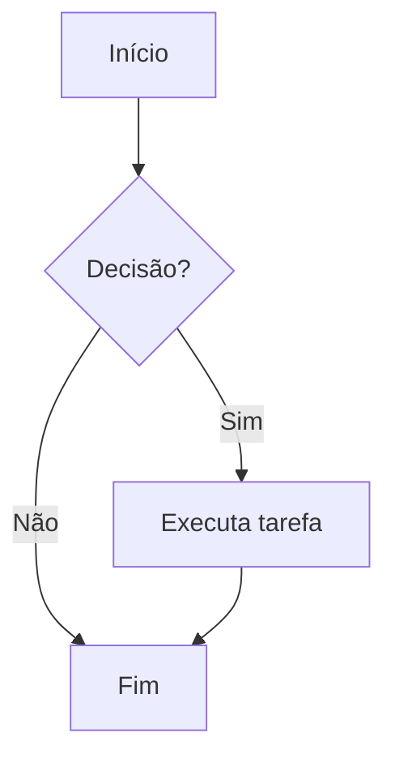

# Título nível 1

## Título nível 2

### Título nível 3

#### Título nível 4

##### Título nível 5

###### Título nível 6

> 💡 **Dica:** Use blockquotes para destacar observações ou citações.

---

## ✅ Lista de Tarefas
- [x] Aprender Markdown
- [x] Testar no GitHub Pages
- [ ] Criar conteúdo avançado
- [ ] Compartilhar com o mundo

---

## 📦 Tabela com Recursos

| Recurso         | Suporte | Observações                          |
|-----------------|---------|--------------------------------------|
| **Títulos**     | ✅      | Usar `#`, `##`, ... até `######`     |
| **Listas**      | ✅      | Ordenadas `1.` ou com `-`            |
| **Códigos**     | ✅      | Inline com `` ` `` ou blocos com ``` |
| **Imagens**     | ✅      | ``                        |
| **Links**       | ✅      | `[texto](url)`                       |
| **Tabelas**     | ✅      | Suporte limitado, mas útil           |
| **Checkboxes**  | ✅      | Com `- [ ]` e `- [x]`                 |
| **Emojis**      | ✅      | GitHub renderiza automaticamente     |

---

## 🖼️ Imagem


---

## 🔗 Link

Veja a [documentação oficial do Markdown](https://www.markdownguide.org/extended/).

---

## 💻 Código com destaque de linguagem

```python
def saudacao(nome):
    print(f"Olá, {nome}!")
```

```javascript
function ola(nome) {
    console.log("Olá, " + nome);
}
```

```html
<h1>Olá Mundo</h1>
```

---

## 🧠 Fluxograma (Mermaid.js — renderizado em plataformas que suportam)



> ⚠️ Observação: O GitHub Pages **não renderiza automaticamente** Mermaid.js sem scripts adicionais.

---

## 🏷️ Etiquetas com nomes de linguagens (simbolicamente)

- 
- 
- 
- 

---

## 🎉 Fim

Markdown é simples, poderoso e ideal para criar conteúdo bem estruturado!
